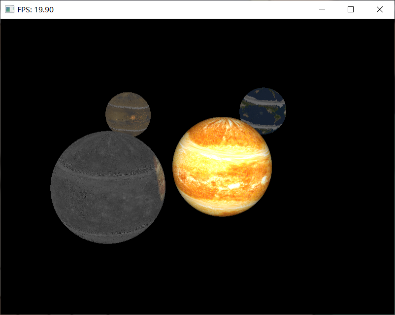

# Final Project Report for CG100433

## Project title
Real-time Solar System by Ray Tracing

## Motivation
It's interesting and fancy.

## The Goal of the project
Animating a solar system by ray tracing

Sub goals:
* Different textures for each object
* Moving objects with orbiting and rotation
* User-control camera
* Real-time rendering

## The Scope of the project
* No user interaction with the objects

## Related CG techniques
* Ray Tracing
* Phong shading
* Shader
* Texture mapping

## Project contents
* A solar system with orbiting and rotation rendered by ray tracing
* User can observe the scene from different angels and distance
* Every object has different textures
* Every object orbits and rotates at different radius and speed.

## Implementation
1. Use Compute Shader for ray-tracing calculation
   1. Workgroup shape of (3, NUM_SAMPLES)

      

      * Shape.x stands for 3 types of reflection in Phong Shading (specular, diffuse, ambient)
      * Shape.y stands for number of samples for each reflection type per pixel (for parallel sampling)
   2. Dispatch workgroups to GPU

      

      X * Y workgroups for a rendering resolution of X * Y

   3. Save pixel colors in Image Texture
      * Use gl_WorkGroupID to determine the location to save the calculated color
      * Use gl_LocalInvocationID.x to determine the reflection type
      * Use gl_LocalInvocationID.y to determine the sample index
      * (NUM_SAMPLES - 1) * gl_LocalInvocationID.y + gl_LocalInvocationID.x as the Image Texture index

   4. Fusion of 3 * NUM_SAMPLES image textures as the final color

      $$\text{FinalColor}_{xy} = \frac{\sum_{i < 3, j < N}tex_{(N - 1) * j + i}[x][y]}{N}$$

      * i, j = gl_LocalInvocationID

2. Ray tracing calculation

   1. Iterative Phong shading

      $$I_k = \text{L} * \prod_{i=1}^N{(C_i * \lambda_{ik})}$$

      * L : origin light color
      * N : iteration depth
      * C_i : color of the i-th hitted surface (determined by texture)
      * k : reflection type
        * 0 : specular
        * 1 : diffuse
        * 2 : ambient
      * $\lambda_k$ : the k-th reflection's proportion ($\lambda_0 + \lambda_1 + \lambda_2 = 1$) (determined by material)

      If not ambient reflection, iteratively calculate reflections until N reaches MAX_DEPTH or the current ray hit a light.

      * N > MAX_DEPTH

        Ray attenuates in the void/darkness

        L = vec3(0.0, 0.0, 0.0)

      * Ray hit a light

        Lights don't reflect any rays

        Iteration early stops 

        L = emited light color

      * Ambient

        Assume there is a ambient light

        Iteration early stops 

        L = ambient light color (default as vec3(1.0, 1.0, 1.0))
   
   2. Reflected Ray
      * k = 0 (specular)
        * Same as Phong reflection model
        * $\text{sharpness} = \infty$
      * k = 1 (diffuse)
        * Uniformly sample a point in a normalized sphere tangent with the hitted surface at the hit location
        * Shoot a ray from the hit location to that point as the reflected ray
      * k = 2 (ambient)
        * No reflected rays
        * Iteration early stop

   3. Spherical texture mapping
      
      * Hit location : p (vec3)
      * Sphere radius : sp.r (float)
      * Sphere center : sp.c (vec3)
      * offset angel in radian: rad (float)

      $$p_\text{norm} = \frac{p - sp.c}{sp.r}$$
      $$x = \arctan{\frac{p_\text{norm} \cdot
                    \begin{bmatrix}
                    \cos(rad)\\
                    0\\
                    -\sin(rad)\\
                    \end{bmatrix}}
                   {p_\text{norm} \cdot
                    \begin{bmatrix}
                    \sin(rad)\\
                    0\\
                    -\cos(rad)\\
                    \end{bmatrix}}}$$
      $$y = p_\text{norm}.y$$
      $$\text{color} = \text{tex}[\frac{x}{\pi} + 0.5][y + 0.5]$$

   4. Emission
      
      Luminous intensity decays by the angel between the ray and the norm vecter of hitted surface

      Emitted light color is the color of the light object at the hit object mutiplied with a decay rate corresponding to this angel

      $$decay = - N \cdot D$$
      $$EmittedColor = decay * ObjectColor$$
      
      * N : norm vector of the hitted surface
      * D : normed ray direction vector
      * ObjectColor : color of the light object at the hit location (given by texture mapping)

## Results

* Nvidia Geforce GTX1050Ti
* 800 * 600
* 4 objects
* Reflection depth 10
* Parallel Sampling
* 3 samples per pixel
* 18 fps

## References
[1]Learn OpenGL https://learnopengl.com/

[2]Wikipedia. Phong reflection model https://en.wikipedia.org/wiki/

[3]OpenGL Wiki https://www.khronos.org/opengl/wiki

[4]Ray Tracing in One Weekend Series https://raytracing.github.io/